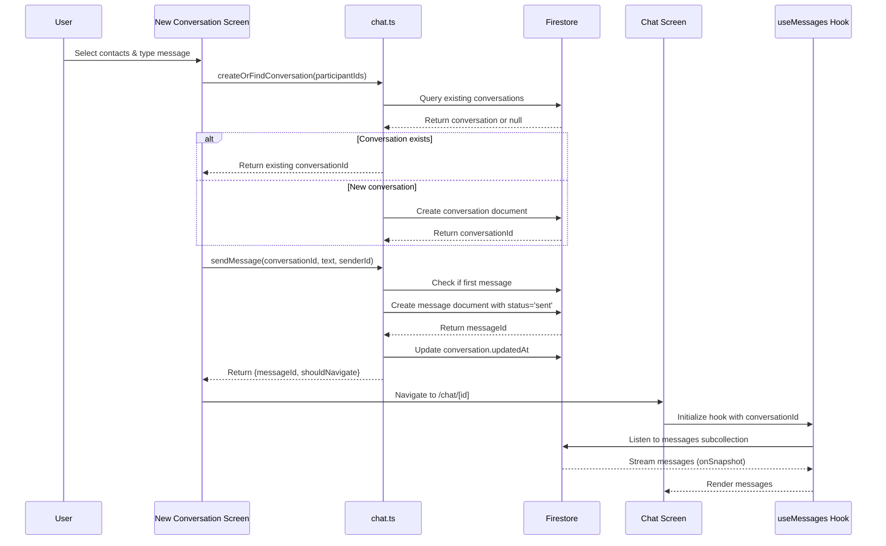
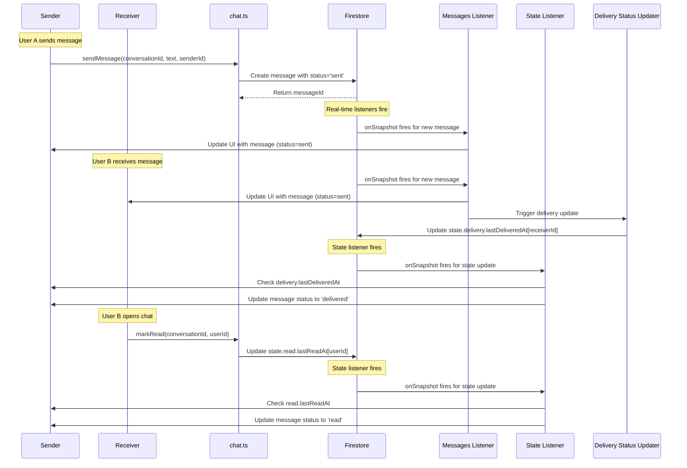
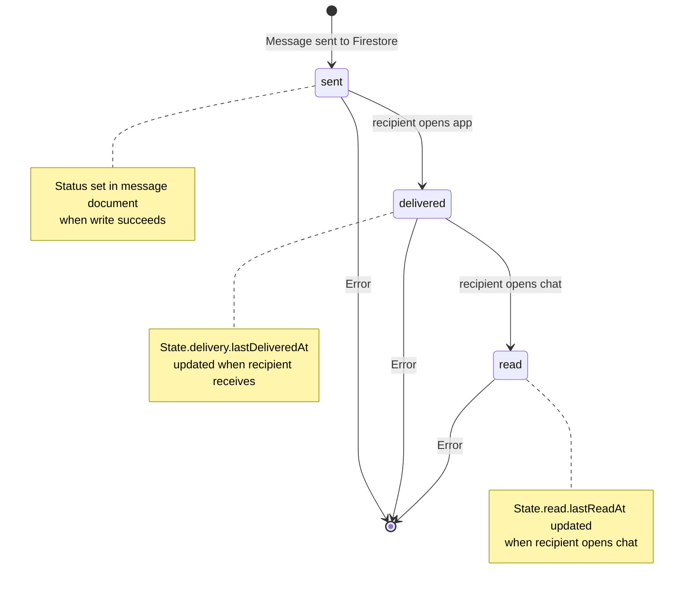

# Architecture Diagram

## High-Level Architecture

```mermaid
graph TB
    subgraph "Frontend - React Native Expo"
        Auth[Auth Screens]
        Tabs[Tabs Navigation]
        NewConv[New Conversation Screen]
        ChatScreen[Chat Screen]
        UI[UI Components]
    end
    
    subgraph "Hooks Layer"
        useAuth[useAuth]
        useConversations[useConversations]
        useMessages[useMessages]
        useUsers[useUsers]
    end
    
    subgraph "Services Layer"
        ChatService[chat.ts]
        AuthService[auth.ts]
    end
    
    subgraph "Firebase SDK"
        Firestore[(Firestore)]
        Auth[Firebase Auth]
    end
    
    subgraph "Firestore Collections"
        Users[users/]
        Conversations[conversations/]
        Messages[conversations/{id}/messages/]
        State[conversations/{id}/state/state]
    end
    
    Auth --> Firestore
    Auth --> Auth
    ChatService --> Firestore
    useAuth --> AuthService
    useConversations --> Firestore
    useMessages --> Firestore
    useUsers --> Firestore
    
    Firestore --> Users
    Firestore --> Conversations
    Firestore --> Messages
    Firestore --> State
    
    Auth --> useAuth
    AuthService --> Auth
    ChatService --> useMessages
    ChatService --> useConversations
    
    UI --> ChatScreen
    UI --> NewConv
    ChatScreen --> useMessages
    NewConv --> ChatService
    NewConv --> useUsers
```

## Data Flow: Creating a New Chat



## Data Flow: Chatting and Status Updates



## Message Status Flow



